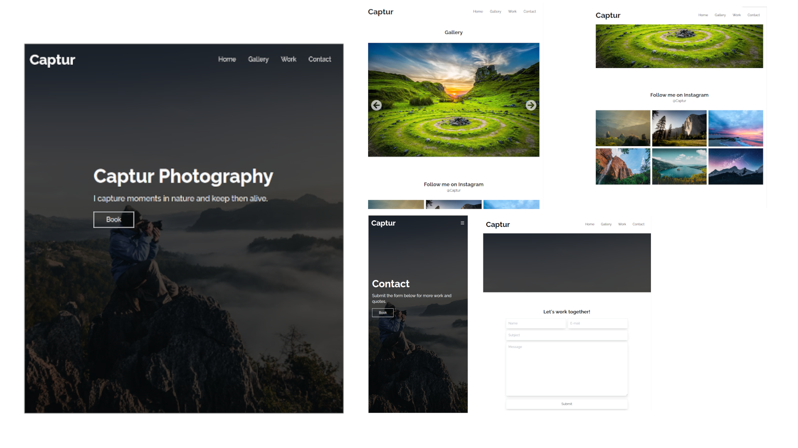

This is a [Next.js](https://nextjs.org/) project bootstrapped with [`create-next-app`](https://github.com/vercel/next.js/tree/canary/packages/create-next-app).

## NOTES:

  <strong>[EN_US]</strong> - This is my final project of a website for a course I studied, from the commits I was implementing and modifying it. 
  <strong>[PT_BR]</strong> - Este é o meu projeto final de um site de um curso que eu estudei, a partir dos <b><i>'commits'</i></b> fui implementando e o modificando.
  
  <strong>Objectives:</strong> principal = [ [ Insert a footer, a BIO page], and others modifications...]
  
  # FINAL PROJECT: Before changes 
  

    
  

  

  
  # FINAL PROJECT: After changes 
  

    In Construction...
  

